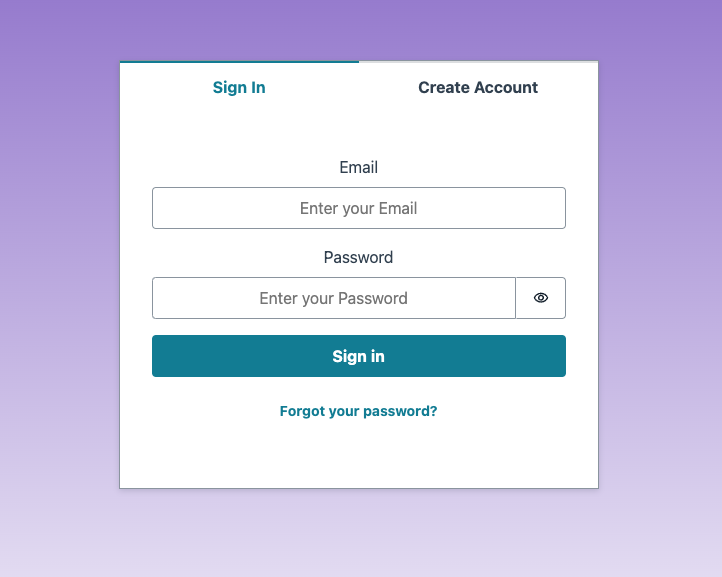
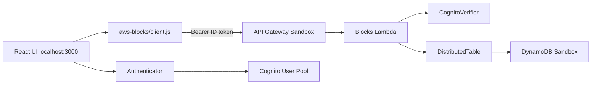
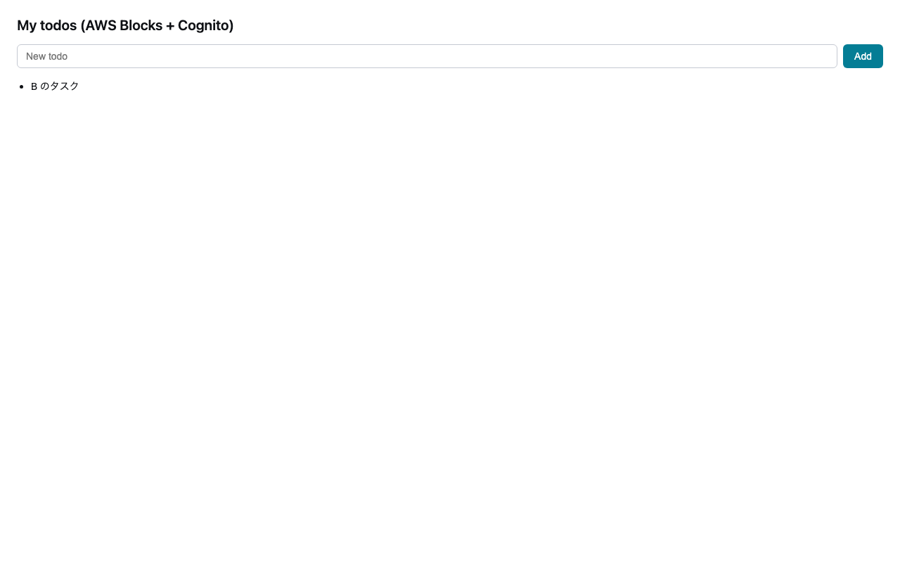

# Amplify の Todo チュートリアルを AWS Blocks で書き直す — バックエンドの中身が見えるハンズオン

> **再現用リポジトリ:** https://github.com/k-adachi-01/hands-on-amplify-todo-to-aws-blocks  
> 章ごとのログ・diff・snapshots: [`docs/chapters/`](chapters/)

## この記事について

| 項目 | 内容 |
| --- | --- |
| **読者** | Amplify Gen 2 の Todo クイックスタートを触ったことがあるフロントエンド寄りの開発者 |
| **作るもの** | ログイン付き Todo アプリ（公式テンプレートを in-place で AWS Blocks 化） |
| **所要時間** | 本編（第1〜2章）90〜120 分 / 発展編（第3章）含め 150〜180 分 |
| **AWS アカウント** | Phase 0 から必要（Amplify Sandbox で Cognito 等を provision） |
| **環境** | [Nix](https://nixos.org/download/) dev shell 推奨（Node.js **20.20+** / npm **10.8+**。Nix 利用時は v22 に固定） |

> **Node バージョン:** `package.json` の `engines` は `>= 20.20.0`。Nix 未使用の場合も **20.20 以上**（22 推奨）を用意してください。

### 始める前のチェックリスト

- [ ] **Node.js 20.20+** と **npm 10.8+**（`nix develop` 後に `node -v` / `npm -v` で確認）
- [ ] **AWS CLI 2.32.0 以降**（`aws --version`）
- [ ] **AWS アカウント**（コンソールにログインできること）
- [ ] **2 つのターミナル**（Sandbox 用と dev server 用）
- [ ] ブラウザで **http://localhost:3000** にアクセスできること

### プレビュー版の前提（ここで止まる場合があります）

本ハンズオンは **2026年6月17日プレビュー公開の AWS Blocks** に依存します。再現性のため、次を事前に確認してください。

| 依存 | 入手方法 | 入らない場合 |
| --- | --- | --- |
| `@aws-blocks/blocks` 等 | 公開 npm（`npm install`） | `npm install` が失敗 → **ここで止まる**。[Developer Guide](https://docs.aws.amazon.com/blocks/latest/devguide/getting-started.html) と npm のエラーを確認 |
| `npx @aws-blocks/create-blocks-app` | 同上（Phase 1 は**本リポジトリでは実行しない**） | ゼロから作る場合のみ必要 |
| `aws login` | AWS CLI 2.32.0+（[公式ブログ](https://aws.amazon.com/jp/blogs/news/simplified-developer-access-to-aws-with-aws-login/)） | 2.32 未満なら [CLI を更新](https://docs.aws.amazon.com/cli/latest/userguide/getting-started-install.html)。`aws login` が使えない組織では、**`aws sts get-caller-identity` が通る従来の認証**（アクセスキー・SSO 等）でも可 |

プレビュー中は API やパッケージ名が変わる可能性があります。

---

## ハンズオンの進め方（git tag 必読）

**clone 直後の `main` ブランチは第3章まで完了したコードです。** 第1章「ログイン不要で Todo 追加」は **HEAD では再現しません**（`requireAuth` 入りの完成形になっているため）。

各章の冒頭で **必ず tag から作業ブランチを作って** から編集してください（タグに直接 checkout すると **detached HEAD** になり、コミットがブランチに紐づかず見失いやすいです）。

```
phase-0-amplify-baseline     … Amplify のみ（Before）
phase-1-blocks-scaffold      … create-blocks-app 直後（第1章の起点）
chapter-1-minimal-crud       … 認証なし CRUD 完了
chapter-2-cognito-auth       … Cognito + ユーザー分離完了（Realtime 等はまだ無し）
chapter-3-advanced           … Realtime / toggle / delete / sort（発展編）
```

### Phase / 章 / ディレクトリ / tag の対応

ディレクトリ番号（`00`〜`04`）と章番号（第1〜3章）は **+1 ずれ** ています。パスを開くときは次の表で読み替えてください。

| 段階 | 章（記事） | ディレクトリ（`docs/chapters/`） | git tag |
| --- | --- | --- | --- |
| Phase 0 | — | `00-clone-and-amplify-baseline` | `phase-0-amplify-baseline` |
| Phase 1 | — | `01-blocks-scaffold` | `phase-1-blocks-scaffold` |
| — | 第1章 | `02-chapter1-minimal-crud` | `chapter-1-minimal-crud` |
| — | 第2章 | `03-chapter2-cognito-auth` | `chapter-2-cognito-auth` |
| — | 第3章 | `04-chapter3-advanced` | `chapter-3-advanced` |

| 章 | 開始時に実行 | 編集後の確認用 tag |
| --- | --- | --- |
| 第1章 | `git switch -c work/chapter1 phase-1-blocks-scaffold` | `git diff chapter-1-minimal-crud` |
| 第2章 | `git switch -c work/chapter2 chapter-1-minimal-crud` | `git diff chapter-2-cognito-auth` |
| 第3章 | `git switch -c work/chapter3 chapter-2-cognito-auth` | `git diff chapter-3-advanced` |

`git switch -c <作業ブランチ名> <tag>` でタグの内容をブランチに載せてから編集します。既に detached HEAD の場合も同様にブランチを切ってください。

完成形と見比べる: `git diff <tag>` または [`docs/chapters/`](chapters/) の `snapshots/` を参照。

---

## AWS Blocks とは

**AWS Blocks** は、Block（認証・DB・Realtime 等）を npm パッケージで組み合わせ、**同じ TypeScript をローカルと AWS で動かす**バックエンドツールキットです（[Developer Guide](https://docs.aws.amazon.com/blocks/latest/devguide/)）。

| 用語 | 意味 |
| --- | --- |
| **Block** | 1 機能分のパッケージ（例: `DistributedTable`, `ApiNamespace`） |
| **`aws-blocks/index.ts`** | バックエンドの本体。API 関数をここに書く |
| **ローカル mock** | `npm run dev` 時、AWS なしで `.bb-data/` 等に保存できるモード |
| **Sandbox / デプロイ** | 同じコードが Lambda + DynamoDB 等で動く |

本ハンズオンで使う Block: `DistributedTable`, `ApiNamespace`, `CognitoVerifier`（第2章）, `Realtime`（第3章）。

---

## なぜ Amplify と比べるのか

読者の多くが [Amplify Todo クイックスタート](https://github.com/aws-samples/amplify-vite-react-template) から入るため、**同じ Todo** で対比します。

| 観点 | Amplify Gen 2 | AWS Blocks |
| --- | --- | --- |
| 書き方 | モデル宣言 → CRUD 自動生成 | `aws-blocks/index.ts` に API を書く |
| 認可 | `allow.publicApiKey()` 等 | API 内の `requireAuth` + キー設計 |
| 見え方 | 処理順がフレームワーク内に隠れやすい | `requireAuth` → `put` と追える |

Amplify を捨てる記事ではなく、**Amplify の Sandbox / UI を活かしつつデータ層を Blocks に差し替える** in-place 移行です。

---

## 章ごとの dev モード（最重要 — ここを読んでから Phase 0 へ）

`npm run dev` だけでは「どこにデータが保存されるか」が決まりません。**章と設定の組み合わせ**で決まります。

| 章 | Sandbox | ブラウザの Blocks RPC | Todo の保存先 |
| --- | --- | --- | --- |
| **第1章**（単体で学ぶ場合） | **不要** | ローカル `http://localhost:3000/aws-blocks/api` | リポジトリ内 **`.bb-data/`**（AWS 不要） |
| **第1章**（本記事の Phase 0 後） | 起動済み | **`amplify_outputs.json` の Sandbox API** | **Sandbox の DynamoDB** |
| **第2章以降**（本記事） | **必須** | Sandbox API + Cognito JWT | Sandbox の DynamoDB |

本記事は **Phase 0 で Sandbox を立てたまま** 第1章に進みます。第1章のコードは認証なしですが、**`client.js` が Sandbox の API Gateway を向くため、データは AWS 上に保存されます**（ローカル `.bb-data/` ではありません）。

**Sandbox の watch:** `npm run sandbox` はファイル変更を監視します。`aws-blocks/index.ts` を編集したり、章用 tag に `git switch` したりすると、Lambda が**自動で再デプロイ**されます。`[Sandbox] Watching for file changes...` のあと `✔ Deployment completed` が出るまで待ってからブラウザを再読込してください。章を切り替えるときは、再デプロイ完了を待つか、一度 Sandbox を止めてから checkout → 再起動すると安全です。

第1章を **完全にオフライン** で試す場合: Sandbox を止め、`amplify_outputs.json` を一時的にリネームしてから `npm run dev` してください（上級者向け。本記事の推奨手順ではありません）。

---

## リポジトリの準備

```bash
git clone git@github.com:k-adachi-01/hands-on-amplify-todo-to-aws-blocks.git
cd hands-on-amplify-todo-to-aws-blocks
nix develop          # 初回は数分かかることがあります
npm install          # 数分かかることがあります。エラーなら「プレビュー版の前提」を参照
```

Nix を初めて使う場合、`nix develop` の前に flakes を有効化してください（`~/.config/nix/nix.conf` に `experimental-features = nix-command flakes`）。[Determinate Installer](https://docs.determinate.systems/determinate-nix/) でも可。

```bash
node -v    # v22.x（Nix）または 20.20+
npm -v     # 10.8+
```

---

## AWS へのログイン

Amplify Sandbox は AWS にリソースを作るため、先に CLI 認証を通します。**要は `aws sts get-caller-identity` が通ること**です。

### 推奨: `aws login`（CLI 2.32.0+）

```bash
aws --version
# 2.32.0 未満なら https://docs.aws.amazon.com/cli/latest/userguide/getting-started-install.html で更新

aws configure set region ap-northeast-1   # 任意のリージョン。Sandbox はリージョン必須
aws login
aws sts get-caller-identity
```

`Account` と `Arn` が JSON で返れば OK。**このコマンドが通らないと Sandbox は動きません。**

### 代替

組織ポリシーで `aws login` が使えない場合、**従来どおり** アクセスキー・SSO・フェデレーション等で構いません。条件は **`aws sts get-caller-identity` が通ること** だけです。

名前付きプロファイルを使う場合のみ `.env.local` に `AWS_PROFILE=...` を設定（[`.env.local.example`](../.env.local.example)）。

### セッション切れ

`InvalidCredentialError` が出たら `aws login` → `aws sts get-caller-identity` → `npm run sandbox` を再実行。

---

## 完成イメージと概念マップ

### Before（Amplify Data）— tag `phase-0-amplify-baseline`

```typescript
client.models.Todo.create({ content: '...' });
client.models.Todo.observeQuery().subscribe(...);
```

- `publicApiKey()` — API Key を知っていれば誰でも読み書き可（学習用。**本番では使わない**）

### After（第2章完了）




- `Authenticator`（UI）+ `CognitoVerifier`（API 内 JWT 検証）+ `userId: user.sub` で分離

### 第2章以降のアーキテクチャ（ハイブリッド dev）



| コンポーネント | 実行場所 |
| --- | --- |
| UI（Vite） | ローカル |
| Cognito / Authenticator | Sandbox User Pool |
| Blocks RPC（ブラウザ） | Sandbox Lambda |

---

## Phase 0: Amplify ベースライン

**ゴール:** Sandbox で Cognito・AppSync・Blocks Lambda を provision し、`amplify_outputs.json` を得る。

### 0-1. 認証確認

```bash
aws sts get-caller-identity
```

### 0-2. ターミナル A — Sandbox

```bash
nix develop
npm run sandbox
```

**成功の目安（この 4 つを確認してから 0-3 へ）:**

- `✔ Deployment completed`
- `AppSync API endpoint = https://...`
- **`File written: amplify_outputs.json`** ← **これが出るまでターミナル B を起動しない**
- `[Sandbox] Watching for file changes...`

初回は約 4〜5 分。`amplify_outputs.json` は **git に commit しない**。

### 0-3. ターミナル B — dev（0-2 完了後）

**`File written: amplify_outputs.json` を確認したあと**、新しいターミナルで:

```bash
nix develop
npm run dev
```

- http://localhost:3000/ に Authenticator が表示されれば Phase 0 完了

詳細: [chapters/00-clone-and-amplify-baseline/README.md](chapters/00-clone-and-amplify-baseline/README.md)

---

## Phase 1: Blocks 統合（参考 — 本リポジトリでは実行しない）

本リポジトリは **すでに Phase 1 済み** です。次を **実行しないでください**（二重 scaffold の原因になります）。

```bash
# 参考のみ — 本ハンズオンでは不要
npx @aws-blocks/create-blocks-app@latest . --yes
```

確認: `git switch -c work/phase1 phase-1-blocks-scaffold` で scaffold 直後の状態を見られます。

---

## 第1章: 最小 CRUD

**ゴール:** `client.models.Todo.*` を `api.createTodo` / `api.listTodos` に置き換える。**認証はまだ入れない。**

### 1-1. 起点に戻る

```bash
git switch -c work/chapter1 phase-1-blocks-scaffold
```

### 1-2. `aws-blocks/index.ts` を書き換える

[`docs/chapters/02-chapter1-minimal-crud/snapshots/index.ts`](chapters/02-chapter1-minimal-crud/snapshots/index.ts) を **`aws-blocks/index.ts` にコピー**（または以下と同等の内容にする）:

```typescript
import { ApiNamespace, Scope } from '@aws-blocks/blocks';
import { DistributedTable } from '@aws-blocks/bb-distributed-table';
import { z } from 'zod';

const scope = new Scope('hands-on-todo');

const todoSchema = z.object({
    todoId: z.string(),
    content: z.string(),
    createdAt: z.number(),
});

const todos = new DistributedTable(scope, 'todos', {
    schema: todoSchema,
    key: { partitionKey: 'todoId' },
});

export const api = new ApiNamespace(scope, 'api', (_context) => ({
    async createTodo(content: string) {
        const todoId = `${Date.now().toString(36)}-${Math.random().toString(36).slice(2, 8)}`;
        const todo = { todoId, content, createdAt: Date.now() };
        await todos.put(todo);
        return todo;
    },

    async listTodos() {
        const items: { todoId: string; content: string; createdAt: number }[] = [];
        for await (const item of todos.scan()) {
            items.push(item);
        }
        return items;
    },
}));
```

ポイント: `_context` は未使用（認証なし）。`partitionKey: 'todoId'` のみ（全員共通 Todo）。

### 1-3. `src/App.tsx` を書き換える

[`docs/chapters/02-chapter1-minimal-crud/snapshots/App.tsx`](chapters/02-chapter1-minimal-crud/snapshots/App.tsx) を参考に、少なくとも次を満たす:

- `import { api } from 'aws-blocks'`
- `await api.createTodo(content)` のあと `await load()`（`observeQuery` の代わりに手動再取得）
- **Authenticator はまだ付けない**（第1章の App には無い）

### 1-4. 動作確認

```bash
# ターミナル B（Sandbox は Phase 0 のまま起動していてよい）
npm run dev
```

ブラウザで `+ new` → Todo が一覧に出れば OK。

**この時点の保存先:** 上記「章ごとの dev モード」のとおり、Phase 0 後なら **Sandbox DynamoDB**。

完成形との diff: `git diff chapter-1-minimal-crud`

---

## 第2章: Cognito + ユーザー分離

**ゴール:** ログインユーザーごとに Todo を分離する。

### 2-1. 起点に戻る

```bash
git switch -c work/chapter2 chapter-1-minimal-crud
```

### 2-2. `aws-blocks/index.ts` を書き換える

[`docs/chapters/03-chapter2-cognito-auth/snapshots/index.ts`](chapters/03-chapter2-cognito-auth/snapshots/index.ts) を **`aws-blocks/index.ts` にコピー**（第3章の toggle/delete / Realtime / sort はまだ無くてよい。第2章 tag の内容に合わせる）。

追加される要点:

- `CognitoVerifier` + `auth.requireAuth(context)` — 実装は同梱の [`aws-blocks/cognito-verifier.ts`](../../aws-blocks/cognito-verifier.ts)（JWT 検証ヘルパー。**新規作成不要**）。`import ... from './cognito-verifier.js'` の `.js` 拡張子は Node ESM の解決ルールによるもの
- `userId: user.sub` を partition key に

### 2-3. 環境変数 `COGNITO_*` について（手で設定しない）

`index.ts` は `process.env.COGNITO_USER_POOL_ID` / `COGNITO_CLIENT_ID` を参照しますが、**読者が `.env` に書く必要はありません**。

- **Sandbox デプロイ時:** `amplify/blocks.ts` が Lambda に環境変数を注入
- **`npm run dev` 時:** dev server が `amplify_outputs.json` の `auth` セクションから注入
- **フロント:** `aws-blocks/client.js` が `amplify_outputs.json` の `custom.blocks_api_url` と Cognito 設定を読む（自動生成。**編集しない**）

Sandbox 完了後に一度:

```bash
npm run blocks:generate-client
```

### 2-4. `src/App.tsx` に Authenticator を追加

[`docs/chapters/03-chapter2-cognito-auth/snapshots/App.tsx`](chapters/03-chapter2-cognito-auth/snapshots/App.tsx) を参考に `Authenticator` でラップ。

### 2-5. 動作確認

**推奨（再現性が高い）— CLI:**

```bash
bash scripts/ensure-chapter2-users.sh
npm run verify:chapter2
```

**UI で試す場合:**

- **`user-a@example.com` は使わない** — `example.com` はメールを受信できず、Cognito の確認コードで**必ず詰まります**
- **自分の実メール**で Create Account するか、上記 CLI 手順を使う
- パスワード例: `TestPass1!`（大文字・小文字・数字・記号が必要）



スクリーンショット（`01`〜`03`）はリポジトリに同梱済み。**再取得は任意**（`npm run capture:screenshots` を使う場合は初回に `npx playwright install chromium` が必要）

完成形との diff: `git diff chapter-2-cognito-auth`

---

## 発展編: 第3章

```bash
git switch -c work/chapter3 chapter-2-cognito-auth
# docs/chapters/04-chapter3-advanced/snapshots/index.ts 等を参照して追記
# または diffs/from-chapter-2.patch を適用
npm run verify:chapter3
```

- `subscribeTodos` が失敗した場合、UI は `load()` で動作（Realtime 未配線時は subscribe がエラーになるだけ）

---

## トラブルシュート

| 症状 | 対処 |
| --- | --- |
| `npm install` で `@aws-blocks/*` が見つからない | プレビュー公開状況を確認。ここでハンズオンは止まる |
| Sandbox 認証エラー | `aws login` → `aws sts get-caller-identity` |
| `npm run dev` が `amplify_outputs.json` で落ちる | ターミナル A の Sandbox が完了しているか確認。0-2 の `File written` を待つ |
| 第1章なのにログインを求められる | `git switch -c work/chapter1 phase-1-blocks-scaffold` からやり直しているか確認（HEAD は第2章以降のコード） |
| UI サインアップで止まる | `example.com` は不可。実メールか `ensure-chapter2-users.sh` |
| `client.js` を編集した | 上書きされる。`npm run blocks:generate-client` |

---

## 公開・片付け

- リポジトリ: https://github.com/k-adachi-01/hands-on-amplify-todo-to-aws-blocks
- Sandbox 削除（任意）: `npm run sandbox:delete` — [SANDBOX-OPERATIONS.md](SANDBOX-OPERATIONS.md)

---

## まとめ

1. **git tag から作業ブランチを切って** 章ごとに編集する（HEAD は完成形）。
2. **保存先は章と Sandbox の有無で変わる**（第1章単体は `.bb-data/`、本記事の Phase 0 後は DynamoDB）。
3. **認可** — Amplify はモデルルール、Blocks は API 内 `requireAuth` + `userId`。
4. **Cognito env** — `amplify_outputs.json` 経由で自動注入。手設定不要。
5. 次: [AWS Blocks Developer Guide](https://docs.aws.amazon.com/blocks/latest/devguide/getting-started.html)
