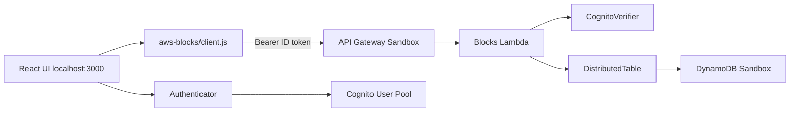

# AWS Blocks（プレビュー）で Amplify Todo を分解してみた — 同じ TypeScript をローカルと AWS で動かすハンズオン

> **再現用リポジトリ:** https://github.com/k-adachi-01/hands-on-amplify-todo-to-aws-blocks  
> 章ごとのログ・diff・snapshots: [`docs/chapters/`](chapters/)（本ファイルは `docs/ARTICLE-DRAFT.md` にあります）

## この記事について

**AWS Blocks** は 2026 年 6 月にプレビュー公開されたバックエンドツールキットです。
Block（認証・DB・Realtime など）を npm パッケージで組み合わせ、**同じ TypeScript コードをローカル開発でも Sandbox でも動かせる**のが最大の特徴です。

「触ってみた」系の記事はすでにいくつかありますが、本記事は **実際に動く Todo アプリを段階的に Blocks 化していく過程** を追えるハンズオン形式にしました。
題材には、ある程度普及している [Amplify Gen 2 の公式 Todo テンプレート](https://github.com/aws-samples/amplify-vite-react-template) を使い、UI と Sandbox は活かしたままデータ層だけ Blocks に差し替えます。
プレビュー版とはいえ、どこまで本格的に使えるかを手で確かめるための実験記録です。

## AWS Blocks とは

`aws-blocks/index.ts` に書いた API が、ローカル dev では mock や dev server 経由で、Sandbox では Lambda + DynamoDB 上で動きます（[Developer Guide](https://docs.aws.amazon.com/blocks/latest/devguide/)）。
ローカルで `npm run dev` しているときも、Sandbox にデプロイしたときも、**同じ API 関数を一切変更しなくていい**。
ローカルで書いた `createTodo` を一文字も変えずに Sandbox の Lambda で動かせます。ローカル用と本番用にコードを分ける作業がそもそも発生しない。この手応えが、このハンズオンを組んだ動機のひとつです。

| 用語 | 意味 |
| --- | --- |
| **Block** | 1 機能分のパッケージ（例: `DistributedTable`, `ApiNamespace`） |
| **`aws-blocks/index.ts`** | バックエンドの本体。API 関数をここに書く |
| **ローカル mock** | `npm run dev` 時、AWS なしで `.bb-data/` 等に保存できるモード |
| **Sandbox / デプロイ** | 同じコードが Lambda + DynamoDB 等で動く |

本ハンズオンで使う Block: `DistributedTable`, `ApiNamespace`, `CognitoVerifier`（第2章）, `Realtime`（第3章）。

## Blocks で実現すること

| 実現したいこと | 従来の Amplify での難しさ | AWS Blocks での実現方法 |
| --- | --- | --- |
| バックエンド処理を自分でコントロールしたい | モデル宣言で大部分が隠蔽される | `aws-blocks/index.ts` に API を明示的に書く |
| ローカルと本番でコードを二重管理したくない | ローカル mock と本番で差が出やすい | 同じコードがローカル dev server と Lambda で動く |
| 認証やユーザー分離を段階的に足したい | モデル認可ルールを最初から設計しがち | API に `requireAuth` を追加するだけで拡張できる |
| プレビュー版でも本格的な検証をしたい | — | Amplify Sandbox と組み合わせれば Cognito + DynamoDB で即動く |

## この記事で起きる変化

Amplify 版では、Todo 作成は次の 1 行に見えます。

```typescript
client.models.Todo.create({ content: title });
```

AWS Blocks 版では、この 1 行を次の処理に分解します。

```typescript
const user = await auth.requireAuth(context);
await todos.put({
  userId: user.sub,
  todoId,
  title,
  createdAt,
});
```

つまり、この記事で見るのは「Todo アプリの作り方」ではなく、**Blocks で API・認証・DynamoDB のキー設計を自分の TypeScript として書く体験**です。
題材の Amplify Todo は、Blocks の挙動を確認するための既知の出発点にすぎません。

## 作るものと到達範囲

| 項目 | 内容 |
| --- | --- |
| **読者** | AWS Blocks をこれから触りたい開発者（Amplify 経験者なら対比しやすいが、必須ではない） |
| **作るもの** | ログイン付き Todo アプリ（公式テンプレートを in-place で AWS Blocks 化） |
| **所要時間** | 本編（第1〜2章）90〜120 分 / 発展編（第3章）含め 150〜180 分 |
| **AWS アカウント** | Phase 0 から必要（Amplify Sandbox で Cognito 等を provision） |

- **本編（第1〜2章）:** Todo の作成・一覧・ログインユーザーごとの分離まで。
- **発展編（第3章）:** Amplify の `observeQuery` に相当する Realtime、toggle、delete、sort（Secondary Index）。

## 先に知っておくこと

このハンズオンは AWS アカウント上に Sandbox リソース（Cognito・DynamoDB・Lambda 等）を作成します。検証後は [`npm run sandbox:delete`](#公開片付け) で削除してください。
また、章ごとの差分を追うため、git tag から作業ブランチを切って進めます（詳細は後述の「ハンズオンの進め方」）。

最低限必要なものは次の 4 つです。

- Node.js 20.20+ / npm 10.8+
- AWS CLI 2.32.0+、または `aws sts get-caller-identity` が通る認証環境
- AWS アカウント
- 2 つのターミナル（Sandbox 用と dev 用）

| ターミナル | 役割 | コマンド | 止めるタイミング |
| --- | --- | --- | --- |
| **A** | Amplify Sandbox（watch） | `npm run sandbox` | ハンズオン終了時 |
| **B** | Blocks dev + Vite UI | `npm run dev` | UI 確認の合間は起動したままで可 |

詳細な環境手順と tag 運用は後述します。

---

## なぜ Amplify Todo を題材にしたのか

[Amplify Todo クイックスタート](https://github.com/aws-samples/amplify-vite-react-template) は、ログイン付き Todo がすぐ動くため、**Blocks 化の前後を同じ UI で比較しやすい**題材です。
Amplify を捨てる記事ではなく、**Sandbox と Authenticator はそのまま活かし、データ層だけ Blocks に差し替える** in-place 移行の実験です。

| 役割 | 今回使うもの | 説明 |
| --- | --- | --- |
| UI | React + Vite | ローカルで動かす画面 |
| ログイン画面 | Amplify UI `Authenticator` | Cognito のサインイン UI |
| AWS 接続情報 | Amplify Sandbox / `amplify_outputs.json` | Cognito や Blocks API の接続先をフロントへ渡す |
| Todo API | AWS Blocks | `createTodo` / `listTodos` 等を自分で書く |
| Todo 保存先 | DynamoDB | Blocks の `DistributedTable` 経由 |

---

## 本記事の推奨ルート（保存先）

本記事では **Phase 0 で Sandbox を起動したまま** 第1章以降に進みます。次の 3 点だけ覚えてください。

- **UI** はローカルの Vite（`http://localhost:3000`）
- **API** は Sandbox の API Gateway / Lambda（`amplify_outputs.json` の `blocks_api_url`）
- **Todo** は Sandbox の **DynamoDB** に保存される（リポジトリ内 `.bb-data/` ではない）

> **重要（第1章でも同じ）:** Phase 0 で起動した Sandbox を**止めずに**第1章へ進みます。第1章のコードは認証なしですが、**作成した Todo はあなたの AWS アカウントの DynamoDB に保存**されます。第2章への移行がスムーズになるための設計です。ローカルファイル `.bb-data/` には保存されません。

`import { api } from 'aws-blocks'` の `api` は、`aws-blocks/index.ts` の `ApiNamespace` から生成されるクライアントです。ブラウザでは普通の関数呼び出しに見えますが、`aws-blocks/client.js`（自動生成・**編集しない**）が Blocks RPC へ HTTP リクエストを送っています。

<details>
<summary>補足: 章ごとの dev モード（オフライン等）</summary>

`npm run dev` だけでは保存先が変わります。本記事以外の学び方として:

| 章 | Sandbox | ブラウザの Blocks RPC | Todo の保存先 |
| --- | --- | --- | --- |
| 第1章（単体） | 不要 | ローカル `/aws-blocks/api` | `.bb-data/` |
| 第1章（本記事 Phase 0 後） | 起動済み | Sandbox API | Sandbox DynamoDB |
| 第2章以降 | 必須 | Sandbox API + JWT | Sandbox DynamoDB |

第1章を完全オフラインで試す場合: Sandbox を止め、`amplify_outputs.json` を一時リネームしてから `npm run dev`（上級者向け）。

</details>

**Sandbox の watch:** `npm run sandbox` はファイル変更を監視します。`aws-blocks/index.ts` を編集したり章用 tag に `git switch` したりすると Lambda が**自動再デプロイ**されます。`[Sandbox] Watching...` のあと `✔ Deployment completed` を待ってからブラウザを再読込してください。

ターミナル A は watch し続けるため、基本的に閉じません。コード変更後は `✔ Deployment completed` を待ってからブラウザを再読み込みします。

---

## リポジトリの準備

```bash
git clone https://github.com/k-adachi-01/hands-on-amplify-todo-to-aws-blocks.git
cd hands-on-amplify-todo-to-aws-blocks
```

SSH を使う場合: `git clone git@github.com:k-adachi-01/hands-on-amplify-todo-to-aws-blocks.git`

clone 後は下の「環境の準備」で Node / npm を確認してから `npm install` します。

### 環境の準備（ローカル実行）

**ローカル PC**（Mac / Linux / WSL）での実行を前提にします。Node.js のバージョン固定には Nix dev shell を推奨しますが、**Nix が入っていなくても進められます**。

以降の手順では `nix develop` を書いている箇所があります。**Nix なし（パターン B）の場合は `nix develop` を省略**し、同じターミナルでそのまま `npm run ...` を実行してください。

#### Nix のインストール（未導入の場合）

パターン A を使うには、先に Nix を入れます。`nix --version` が通ればこの節は飛ばして構いません。

**推奨: [Determinate Installer](https://docs.determinate.systems/determinate-nix/)** — flakes が最初から有効で、本リポジトリの `nix develop` にそのまま使えます。

```bash
# macOS / Linux（対話あり。完了後はターミナルを開き直す）
curl --proto '=https' --tlsv1.2 -sSf -L https://install.determinate.systems/nix | sh -s -- install

# 確認（新しいターミナルで）
nix --version
```

**代替: [公式インストーラ](https://nixos.org/download/)** — インストール後に flakes を有効化してください。

```bash
sh <(curl -L https://nixos.org/nix/install) --yes

# ~/.config/nix/nix.conf を作成または編集（1 行でよい）
mkdir -p ~/.config/nix
echo 'experimental-features = nix-command flakes' >> ~/.config/nix/nix.conf

# ターミナルを開き直して確認
nix --version
```

| 環境 | メモ |
| --- | --- |
| **macOS** | 上記どちらでも可。Apple Silicon / Intel とも対応 |
| **Linux** | 同上 |
| **WSL2** | Determinate または公式インストーラ。`/mnt/c/...` 上の clone より Linux ホーム（`~/src/...`）推奨 |

インストール後に `nix: command not found` が続く場合は、**ターミナルを再起動**するか、`source /nix/var/nix/profiles/default/etc/profile.d/nix-daemon.sh` を実行してください。

#### パターン A: Nix あり（推奨）

再現性を優先する場合はこちら。dev shell 内で Node v22 / npm 10.9 が固定されます。

```bash
nix develop          # 初回は数分
node -v              # v22.x
npm -v               # 10.8+
npm install          # 数分かかることがあります。エラーなら「プレビュー版の前提」を参照
```

#### パターン B: Nix なし（ローカル）

`nix: command not found` と出たら、Nix は不要です。ホストに **Node.js 20.20+ / npm 10.8+**（22 推奨）を用意して進めます。

```bash
node -v              # v20.20.0 以上（v22.x 推奨）
npm -v               # 10.8.0 以上

# バージョンが足りない場合の例（nvm）
# curl -o- https://raw.githubusercontent.com/nvm-sh/nvm/v0.40.1/install.sh | bash
# source ~/.bashrc   # または ~/.zshrc
# nvm install 22 && nvm use 22

npm install          # 数分かかることがあります。エラーなら「プレビュー版の前提」を参照
```

`npm install` 完了時に `101 vulnerabilities` などと表示されても、**ハンズオン中は `npm audit fix` を実行しないでください**（Amplify / CDK の間接依存による警告で、手順どおり動かす分には問題ありません）。

名前付き AWS プロファイル（`AWS_PROFILE`）を使う場合は、Nix の dev shell では `.env.local` が自動読み込みされますが、Nix なしでは各ターミナルで次を実行するか、シェルに export してください。

```bash
cp .env.local.example .env.local   # 未作成なら
# .env.local の AWS_PROFILE=... のコメントを外してプロファイル名を合わせる
set -a && source .env.local && set +a
```

> **Node バージョン:** `package.json` の `engines` は `>= 20.20.0`。Nix 利用時は dev shell で v22 に固定されます。

<details>
<summary>プレビュー版の前提（2026年6月公開）</summary>

本ハンズオンは **2026年6月17日プレビュー公開の AWS Blocks** に依存します。preview 版ですが、本記事の手順どおりで Cognito + DynamoDB まで実際に動かせます。

| 依存 | 入手方法 | 入らない場合 |
| --- | --- | --- |
| `@aws-blocks/blocks` 等 | 公開 npm（`npm install`） | `npm install` が失敗 → **ここで止まる**。[Developer Guide](https://docs.aws.amazon.com/blocks/latest/devguide/getting-started.html) と npm のエラーを確認 |
| `npx @aws-blocks/create-blocks-app` | 同上（Phase 1 は**本リポジトリでは実行しない**） | ゼロから作る場合のみ必要 |
| `aws login` | AWS CLI 2.32.0+（[公式ブログ](https://aws.amazon.com/jp/blogs/news/simplified-developer-access-to-aws-with-aws-login/)） | 2.32 未満なら [CLI を更新](https://docs.aws.amazon.com/cli/latest/userguide/getting-started-install.html)。`aws login` が使えない組織では、**`aws sts get-caller-identity` が通る従来の認証**（アクセスキー・SSO 等）でも可 |

プレビュー中は API やパッケージ名が変わる可能性があります。

</details>

---

## AWS へのログイン

Amplify Sandbox は AWS にリソースを作るため、先に CLI 認証を通します。**要は `aws sts get-caller-identity` が通ること**です。

### 推奨: `aws login`（CLI 2.32.0+）

```bash
aws --version
# 2.32.0 未満なら https://docs.aws.amazon.com/cli/latest/userguide/getting-started-install.html で更新

aws configure set region ap-northeast-1   # 任意のリージョン。Sandbox はリージョン必須
aws login
aws sts get-caller-identity
```

`Account` と `Arn` が JSON で返れば OK。**このコマンドが通らないと Sandbox は動きません。**

### 代替

組織ポリシーで `aws login` が使えない場合、**従来どおり** アクセスキー・SSO・フェデレーション等で構いません。条件は **`aws sts get-caller-identity` が通ること** だけです。

名前付きプロファイルを使う場合のみ `.env.local` に `AWS_PROFILE=...` を設定（[`.env.local.example`](../.env.local.example)）。

### セッション切れ

`InvalidCredentialError` が出たら `aws login` → `aws sts get-caller-identity` → `npm run sandbox` を再実行。

---

## ハンズオンの進め方（git tag 必読）

**clone 直後の `main` ブランチは第3章まで完了したコードです。** 第1章「ログイン不要で Todo 追加」は **HEAD では再現しません**（`requireAuth` 入りの完成形になっているため）。

各章の冒頭で **必ず tag から作業ブランチを作って** から編集してください（タグに直接 checkout すると **detached HEAD** になり、コミットがブランチに紐づかず見失いやすいです）。

```
phase-0-amplify-baseline     … Amplify のみ（Before）
phase-1-blocks-scaffold      … create-blocks-app 直後（第1章の起点）
chapter-1-minimal-crud       … 認証なし CRUD 完了
chapter-2-cognito-auth       … Cognito + ユーザー分離完了（Realtime 等はまだ無し）
chapter-3-advanced           … Realtime / toggle / delete / sort（発展編）
```

### Phase / 章 / ディレクトリ / tag の対応

ディレクトリ番号（`00`〜`04`）と章番号（第1〜3章）は **+1 ずれ** ています。パスを開くときは下表で読み替えてください。

| 段階 | 章（記事） | ディレクトリ（`docs/chapters/`） | git tag |
| --- | --- | --- | --- |
| Phase 0 | — | `00-clone-and-amplify-baseline` | `phase-0-amplify-baseline` |
| Phase 1 | — | `01-blocks-scaffold` | `phase-1-blocks-scaffold` |
| — | 第1章 | `02-chapter1-minimal-crud` | `chapter-1-minimal-crud` |
| — | 第2章 | `03-chapter2-cognito-auth` | `chapter-2-cognito-auth` |
| — | 第3章 | `04-chapter3-advanced` | `chapter-3-advanced` |

| 章 | 開始時に実行 | 編集後の確認用 tag |
| --- | --- | --- |
| 第1章 | `git switch -c work/chapter1 phase-1-blocks-scaffold` | `git diff chapter-1-minimal-crud` |
| 第2章 | `git switch -c work/chapter2 chapter-1-minimal-crud` | `git diff chapter-2-cognito-auth` |
| 第3章 | `git switch -c work/chapter3 chapter-2-cognito-auth` | `git diff chapter-3-advanced` |

`git switch -c <作業ブランチ名> <tag>` でタグの内容をブランチに載せてから編集します。既に detached HEAD の場合も同様にブランチを切ってください。

**同名ブランチが既にある場合:** `git switch work/chapter1`（移動）か `git switch -C work/chapter1 <tag>`（作り直し）を使います。`git switch -c` を再実行すると `already exists` で止まります。

### 完成タグとの照合

| 目的 | コマンド |
| --- | --- |
| 完成タグと**一致しているか**確認（差分なし = OK） | `git diff --exit-code chapter-1-minimal-crud` など |
| この章で**自分が変更した内容**を見る | `git diff phase-1-blocks-scaffold...HEAD`（第1章）など |

完成形と見比べる: 上記のほか [`docs/chapters/`](chapters/) の `snapshots/` を参照。

### なぜ tag から作業ブランチを切るのか

tag は「その章の**開始地点のスナップショット**」です。`main` は完成形なので、そのまま編集すると答え合わせができません。`git switch -c work/chapterN <tag>` で **「この章用の作業台」** を作り、そこで編集 → `git diff --exit-code chapter-N-...` で完成形と一致するか確認します。

```
clone 直後の main（完成形・触らない）
        │
        ├─ git switch -c work/chapter1 phase-1-blocks-scaffold  → 編集 → diff chapter-1-minimal-crud
        ├─ git switch -c work/chapter2 chapter-1-minimal-crud   → 編集 → diff chapter-2-cognito-auth
        └─ git switch -c work/chapter3 chapter-2-cognito-auth   → 編集 → diff chapter-3-advanced
```

---

## 完成イメージと概念マップ

### Before（Amplify Data）— tag `phase-0-amplify-baseline`

```typescript
client.models.Todo.create({ content: '...' });
client.models.Todo.observeQuery().subscribe(...);
```

- `publicApiKey()` — API Key を知っていれば誰でも読み書き可（学習用。**本番では使わない**）

### After（第2章完了）


- `Authenticator`（UI）+ `CognitoVerifier`（API 内 JWT 検証）+ `userId: user.sub` で分離

### 第2章以降のアーキテクチャ（ハイブリッド dev）



| コンポーネント | 実行場所 |
| --- | --- |
| UI（Vite） | ローカル |
| Cognito / Authenticator | Sandbox User Pool |
| Blocks RPC（ブラウザ） | Sandbox Lambda |

---

## Phase 0: Amplify ベースライン

**この Phase ではまだ Todo のコードは変更しません。** Amplify Sandbox を起動し、以降の章で使う `amplify_outputs.json` を生成します。

**成功条件:** ブラウザで http://localhost:3000/ を開き、**Authenticator のログイン画面**が表示されること。

（裏側では Cognito・AppSync・Blocks Lambda 等も provision されますが、Phase 0 では接続情報が取れれば十分です。）

### 0-1. 認証確認

```bash
aws sts get-caller-identity
```

### 0-2. ターミナル A — Sandbox

```bash
nix develop          # パターン B（Nix なし）の場合は省略
npm run sandbox
```

**成功の目安（この 4 つを確認してから 0-3 へ）:**

- `✔ Deployment completed`
- `AppSync API endpoint = https://...`
- **`File written: amplify_outputs.json`**（※ これが出るまでターミナル B を起動しない）
- `[Sandbox] Watching for file changes...`

`amplify_outputs.json` には **Cognito User Pool の接続情報** と **Blocks API の URL**（`custom.blocks_api_url`）が自動で書き込まれます。フロントの `aws-blocks/client.js` がこのファイルを読み、ログインと API 呼び出し先を決めます。**git には commit しないでください。**

初回は約 4〜5 分。

### 0-3. ターミナル B — dev（0-2 完了後）

**`File written: amplify_outputs.json` を確認したあと**、新しいターミナルで:

```bash
nix develop          # パターン B（Nix なし）の場合は省略
npm run dev
```

- http://localhost:3000/ に Authenticator が表示されれば Phase 0 完了

> **次の章へ:** 第1章では tag `phase-1-blocks-scaffold` に切り替えます。**その時点の UI から Authenticator は消え**、`+ new` ボタンのみの画面になります（下記 1-1 参照）。Sandbox は起動したままにしてください。

詳細: [chapters/00-clone-and-amplify-baseline/README.md](chapters/00-clone-and-amplify-baseline/README.md)

---

## Phase 1: Blocks 統合（参考 — 本リポジトリでは実行しない）

本リポジトリは **すでに Phase 1 済み** です。次を **実行しないでください**（二重 scaffold の原因になります）。

```bash
# 参考のみ — 本ハンズオンでは不要
npx @aws-blocks/create-blocks-app@latest . --yes
```

確認: `git switch -c work/phase1 phase-1-blocks-scaffold` で scaffold 直後の状態を見られます。

---

## 第1章: 最小 CRUD

第1章では、Blocks の入口を掴みます。
`aws-blocks/index.ts` に `api.createTodo` / `api.listTodos` を書けば、**同じ関数がローカル dev と Sandbox の Lambda の両方でそのまま動きます**。第1章で最初に確かめるのはこの一点です。
Realtime も認証もこの章では扱いません。機能を絞るのは、API と保存処理を最小単位で観察するためです。

Phase 0 で見たログイン画面はいったん外れ、Todo は全員共通の一覧になります。
認証とユーザー分離は、第2章で API 側に明示的に戻します。

**ゴール:** Blocks で Todo の作成と一覧取得を自分の API 関数として書く。

### この章の作業の流れ（必ずこの順で）

1. `git switch -c work/chapter1 phase-1-blocks-scaffold` で作業ブランチ作成
2. スナップショットを `aws-blocks/index.ts` と `src/App.tsx` にコピー
3. Sandbox の `✔ Deployment completed` を待ってから `npm run dev` で確認
4. `git diff --exit-code chapter-1-minimal-crud` で完成形と一致するか確認

### 1-1. 起点に戻る

```bash
git switch -c work/chapter1 phase-1-blocks-scaffold
git branch --show-current   # → work/chapter1
git status --short          # → 空であること
```

> **この時点の UI:** Authenticator（ログイン画面）は**表示されません**。`+ new` ボタンと Todo 一覧だけの画面です。  
> `phase-1-blocks-scaffold` の `App.tsx` には `Authenticator` がなく、Amplify Data の Todo UI（認証なし）が残っています。Phase 0 で見たログイン画面は **Phase 0 用のコード**の状態です。  
> `git switch` 後は Sandbox が再デプロイするので、**`✔ Deployment completed` を待ってから**ブラウザを再読み込みしてください。

> **保存先の再確認:** Sandbox は Phase 0 のまま起動中です。第1章で追加した Todo も **AWS の DynamoDB** に保存されます（`.bb-data/` ではありません）。

### 1-2. `aws-blocks/index.ts` を書き換える

[`docs/chapters/02-chapter1-minimal-crud/snapshots/index.ts`](chapters/02-chapter1-minimal-crud/snapshots/index.ts) を **`aws-blocks/index.ts` にコピー**（または以下と同等の内容にする）:

```typescript
import { ApiNamespace, Scope } from '@aws-blocks/blocks';
import { DistributedTable } from '@aws-blocks/bb-distributed-table';
import { z } from 'zod';

const scope = new Scope('hands-on-todo');

const todoSchema = z.object({
    todoId: z.string(),
    content: z.string(),
    createdAt: z.number(),
});

const todos = new DistributedTable(scope, 'todos', {
    schema: todoSchema,
    key: { partitionKey: 'todoId' },
});

export const api = new ApiNamespace(scope, 'api', (_context) => ({
    async createTodo(content: string) {
        const todoId = `${Date.now().toString(36)}-${Math.random().toString(36).slice(2, 8)}`;
        const todo = { todoId, content, createdAt: Date.now() };
        await todos.put(todo);
        return todo;
    },

    async listTodos() {
        return await Array.fromAsync(todos.scan());
    },
}));
```

**補足:**

- **Zod（`z.object`）:** Todo データの形（フィールド名・型）を定義しています。不正なデータが保存されるのを防ぎます。
- **`Array.fromAsync`:** `todos.scan()` はデータを少しずつ返す非同期イテレータです。一覧表示用に配列へまとめるために使います。
- **`_context`:** 第1章では認証しないため未使用です。第2章で `requireAuth` に使います。

ポイント: `_context` は未使用（認証なし）。`partitionKey: 'todoId'` のみ（**ユーザー分離なし** — 全員共通の Todo 一覧）。

| 章 | partition key | 意味 |
| --- | --- | --- |
| 第1章 | `todoId` | Todo ごとに保存するだけ |
| 第2章 | `userId` | ログインユーザーごとに分離（後述） |

非同期イテレータの配列化は、全章 **`Array.fromAsync(...)`** で統一しています。

### 1-3. `src/App.tsx` を書き換える

Amplify 版では `client.models.Todo.observeQuery()` が一覧を購読していました。第1章では Realtime はまだ扱わないため、**`load()` で `api.listTodos()` を呼び、作成後に再取得**します。

[`docs/chapters/02-chapter1-minimal-crud/snapshots/App.tsx`](chapters/02-chapter1-minimal-crud/snapshots/App.tsx) を **`src/App.tsx` にコピー**（推奨）。要点:

```typescript
import { api } from 'aws-blocks';

async function load() {
    setTodos(await api.listTodos());
}

async function createTodo() {
    const content = window.prompt('Todo content');
    if (!content?.trim()) return;
    await api.createTodo(content.trim());
    await load();
}
```

- **Authenticator はまだ付けない**

### 1-4. 動作確認

```bash
# ターミナル B（Sandbox は Phase 0 のまま起動していてよい）
npm run dev
```

ブラウザで `+ new` → Todo が一覧に出れば OK。

**保存先の確認（推奨）:**

- リポジトリ直下に **`.bb-data/` が作られていない**こと（＝ローカル mock ではない）
- 任意: AWS コンソール → DynamoDB → `hands-on-todo-*` 系テーブルにアイテムがあること

**CLI 検証（任意）:**

`verify:chapter1` はローカル dev server の Blocks API に `createTodo` / `listTodos` を呼び、応答が返ることを確認します。

```bash
npm run verify:chapter1
# 末尾に OK と表示されれば成功
```

完成タグと一致: `git diff --exit-code chapter-1-minimal-crud`

**この章完了時点でできること:**

- [ ] ブラウザで `+ new` から Todo を追加・一覧表示できる
- [ ] ログイン画面が出ない（認証なし CRUD）
- [ ] `git diff --exit-code chapter-1-minimal-crud` が差分なし（exit code 0）

---

## 第2章: Cognito + ユーザー分離

第2章で実感できる Blocks の価値のひとつは、**認証を後から足しやすい**ことです。
第1章のコードに `CognitoVerifier` と `requireAuth` を追加するだけで、ユーザー分離が完成します。
最初から認可をすべて決め打ちしなくても、必要になった章で API に足せます。

`Authenticator` はブラウザ側のログイン UI です。
API 側では、リクエストに付いた ID token を `CognitoVerifier` で検証し、検証済みの `sub` を DynamoDB の partition key に使います。

**ゴール:** ログインユーザーごとに Todo を分離する。

### この章の作業の流れ（必ずこの順で）

1. `git switch -c work/chapter2 chapter-1-minimal-crud` で作業ブランチ作成
2. `snapshots/index.ts` と `snapshots/App.tsx` をコピー（推奨）
3. `npm run blocks:generate-client`（必要なら）→ `npm run dev`
4. `bash scripts/ensure-chapter2-users.sh` → `npm run verify:chapter2`
5. `git diff --exit-code chapter-2-cognito-auth` で完成形と一致するか確認

### 2-1. 起点に戻る

```bash
git switch -c work/chapter2 chapter-1-minimal-crud
git branch --show-current   # → work/chapter2
```

### 2-2. `aws-blocks/index.ts` を書き換える

> **安全策:** この章は [`snapshots/index.ts`](chapters/03-chapter2-cognito-auth/snapshots/index.ts) を **丸ごと `aws-blocks/index.ts` にコピー**するのが確実です。

第3章の toggle/delete / Realtime / sort はまだ入れません。

> **なぜ `content` → `title` に変えるのか:** 第3章で優先度ソート（`byTitle`）や楽観的ロック用の `version` を追加するため、フィールド名を整理します。本ハンズオンは検証後に Sandbox を削除する前提なので、**既存の Todo データとの互換性は気にしなくて構いません**（スキーマ変更で古いデータは読めなくなります）。

| 項目 | 第1章 | 第2章 |
| --- | --- | --- |
| 本文フィールド | `content` | `title` |
| partition key | `todoId` | `userId`（= Cognito `sub`） |
| 認証 | なし | `requireAuth` 必須 |

追加・変更される要点:

- `CognitoVerifier` + `auth.requireAuth(context)` — 実装は同梱の [`aws-blocks/cognito-verifier.ts`](../aws-blocks/cognito-verifier.ts)（JWT 検証。**新規作成不要**）。`import ... from './cognito-verifier.js'` の `.js` は Node ESM の解決ルール
- **`content` → `title`** にフィールド名を変更（`createTodo(title)` / `todo.title`）
- `userId: user.sub` を partition key に（上表）

**補足 — `requireAuth`:** リクエストの ID token を検証し、成功時に `user.sub`（Cognito のユーザー ID）を返します。これを `userId` として保存することで、ログインユーザーごとに Todo を分離します。`Authenticator` はブラウザのログイン UI だけで、**API 側の検証は別**です。

### 2-3. 環境変数 `COGNITO_*` について（手で設定しない）

`index.ts` は `process.env.COGNITO_USER_POOL_ID` / `COGNITO_CLIENT_ID` を参照しますが、**読者が `.env` に書く必要はありません**。

- **Sandbox デプロイ時:** `amplify/blocks.ts` が Lambda に環境変数を注入
- **`npm run dev` 時:** dev server が `amplify_outputs.json` の `auth` セクションから注入
- **フロント:** `aws-blocks/client.js` が `amplify_outputs.json` の `custom.blocks_api_url` と Cognito 設定を読む（自動生成。**編集しない**）

Sandbox 完了後に一度:

```bash
npm run blocks:generate-client
```

### 2-4. `src/App.tsx` に Authenticator を追加

[`docs/chapters/03-chapter2-cognito-auth/snapshots/App.tsx`](chapters/03-chapter2-cognito-auth/snapshots/App.tsx) を **`src/App.tsx` にコピー**（推奨）。

第1章からの主な変更:

- `Authenticator` でラップ + `src/main.tsx` の `Amplify.configure(outputs)`（tag 上は済み）
- `window.prompt` → **入力欄 + Add ボタン**
- `todo.content` → **`todo.title`**
- 第3章の Sort / checkbox / Delete は**まだ無し**

第2章以降、`client.js` のリクエストに Cognito の **ID token** が付与されます。

### 2-5. 動作確認

**推奨（再現性が高い）— CLI:**

`ensure-chapter2-users.sh` は Sandbox の User Pool に検証用ユーザー（`user-a@example.com` / `user-b@example.com`、パスワード `TestPass1!`）を作成し、メール確認なしで使えるようにします。

`verify:chapter2` は上記ユーザーでサインインし、Blocks API を実際に呼び出して **user-a と user-b の Todo が混ざらないこと**を自動確認します。

```bash
bash scripts/ensure-chapter2-users.sh
npm run verify:chapter2
```

成功時の末尾:

```text
=== Isolation check ===
OK — userId partition isolation verified
```

**UI で試す場合:**

- **`user-a@example.com` は使わない** — `example.com` はメールを受信できず、Cognito の確認コードで**必ず詰まります**
- **自分の実メール**で Create Account するか、上記 CLI 手順を使う
- パスワード例: `TestPass1!`（大文字・小文字・数字・記号が必要）


スクリーンショット（`01`〜`03`）は第2章 UI（入力欄 + Add + タイトル一覧のみ）に合わせて同梱済み。実機で撮り直す場合: `bash scripts/ensure-chapter2-users.sh` → `npm run dev` → `npx playwright install chromium` → `npm run capture:screenshots`

完成タグと一致: `git diff --exit-code chapter-2-cognito-auth`

**この章完了時点でできること:**

- [ ] ログイン後に Todo を追加・一覧表示できる
- [ ] user-a と user-b で一覧が分離されている（スクショまたは `verify:chapter2`）
- [ ] Sort / checkbox / Delete はまだ無い（第3章）

---

## 発展編: 第3章

第3章では、Blocks の API を段階的に拡張し、実用的な Todo 機能を戻します。
Realtime（`subscribeTodos`）、toggle、delete、sort を、すべて同じ `aws-blocks/index.ts` に関数として足していきます。
状態更新や競合制御（楽観ロック）も、フレームワーク任せにせず自分のコードとして書きます。

**ゴール:** Realtime・toggle（楽観ロック）・delete・Secondary Index による sort を追加する。

### この章の作業の流れ（必ずこの順で）

1. `git switch -c work/chapter3 chapter-2-cognito-auth`
2. `npm install` → `git apply .../from-chapter-2.patch`（またはスナップショットコピー）
3. `✔ Deployment completed` を待つ → `npm run dev`
4. `bash scripts/ensure-chapter2-users.sh` → `npm run verify:chapter3`
5. `git diff --exit-code chapter-3-advanced`

### 3-1. 起点に戻る

```bash
git switch -c work/chapter3 chapter-2-cognito-auth
```

### 3-2. 依存の追加

第3章では `@aws-blocks/bb-realtime` が必要です。

```bash
npm install
```

（`from-chapter-2.patch` 適用後も `aws-blocks/package.json` に realtime が追加されるため、再実行してください。）

### 3-3. コードの適用

**方法 A — パッチ（推奨）:**

```bash
git apply docs/chapters/04-chapter3-advanced/diffs/from-chapter-2.patch
```

**方法 B — スナップショットをコピー:**

- [`docs/chapters/04-chapter3-advanced/snapshots/index.ts`](chapters/04-chapter3-advanced/snapshots/index.ts) → `aws-blocks/index.ts`
- [`docs/chapters/04-chapter3-advanced/snapshots/App.tsx`](chapters/04-chapter3-advanced/snapshots/App.tsx) → `src/App.tsx`

**追加される API（概要）:**

| API | 役割 |
| --- | --- |
| `subscribeTodos()` | Realtime チャンネル購読（`observeQuery` 相当） |
| `createTodo(title, priority?)` | `priority` / `version` フィールド追加 |
| `listTodos(sortBy?)` | `byPriority` / `byTitle` の Secondary Index でソート |
| `toggleTodo(todoId)` | `version` + `ifFieldEquals` による楽観的ロック |
| `deleteTodo(todoId)` | ユーザー自身の Todo を削除 |

`index.ts` だけ更新して `App.tsx` を忘れると UI に Sort / checkbox / Delete が出ません。**両方**更新してください。

Sandbox の watch が再デプロイを完了するまで待ってから UI を確認します。

### 3-4. 動作確認

第2章と同様、検証用ユーザーが必要です（UI で実メールだけ使った場合は `user-a@example.com` が存在しません）。

```bash
bash scripts/ensure-chapter2-users.sh
npm run verify:chapter3
```

成功時の末尾: `OK — toggle, sort, delete verified`

実メールで検証する場合: `CHAPTER2_USER_A=your@email.com npm run verify:chapter3`

**Realtime（`subscribeTodos`）について:**

- Amplify の `observeQuery` に相当する「変更のプッシュ通知」です。
- Sandbox や dev 環境によっては WebSocket 接続が失敗することがあります。**create / list / toggle / delete は `load()` で動き続けます。**
- UI は subscribe 失敗時も手動 `load()` にフォールバックする設計です（エラーはコンソールに出るだけ）。

`verify:chapter3` は検証用ユーザーで API を呼び、toggle・sort・delete の動作を自動確認します（**実行前に `ensure-chapter2-users.sh` が必要**）。

完成タグと一致: `git diff --exit-code chapter-3-advanced`

**この章完了時点でできること:**

- [ ] Sort / 完了トグル / Delete が UI で動く
- [ ] `npm run verify:chapter3` が `OK — toggle, sort, delete verified` で終わる

---

## トラブルシュート

### git で迷子になったとき

```bash
git branch --show-current    # 今いるブランチ名
git status --short         # 未コミットの変更があるか
```

| 状況 | 回復コマンド |
| --- | --- |
| どの章からやり直したいか分かっている | `git switch -C work/chapterN <その章の開始 tag>` |
| detached HEAD にいる | `git switch -c work/chapterN <tag>` でブランチを作る |
| 変更を全部捨てて tag の状態に戻す | `git switch -C work/chapterN <tag>` |

例（第1章を最初から）: `git switch -C work/chapter1 phase-1-blocks-scaffold`

### その他の症状

| 症状 | 対処 |
| --- | --- |
| `npm install` で `@aws-blocks/*` が見つからない | プレビュー公開状況を確認。ここでハンズオンは止まる |
| Sandbox 認証エラー | `aws login` → `aws sts get-caller-identity` |
| `npm run dev` が `amplify_outputs.json` で落ちる | ターミナル A の Sandbox が完了しているか確認。0-2 の `File written` を待つ |
| 第1章なのにログインを求められる（`main` で作業） | `git switch -C work/chapter1 phase-1-blocks-scaffold` からやり直す |
| 第1章なのにログインを求められる（Sandbox 古い） | `✔ Deployment completed` を待ってブラウザを再読込 |
| 第1章なのにログインを求められる（dev 古い） | ターミナル B で `npm run dev` を再起動 |
| `git switch -c work/chapter1` が失敗（同名ブランチあり） | `git switch work/chapter1` または `git switch -C work/chapter1 <tag>` |
| コードを変えたのに UI が変わらない | Sandbox の `✔ Deployment completed` を待ってブラウザを再読込。dev server も再起動 |
| UI サインアップで止まる | `example.com` は不可。実メールか `ensure-chapter2-users.sh` |
| `verify:chapter2` / `verify:chapter3` が認証失敗 | **先に** `bash scripts/ensure-chapter2-users.sh`（第2章未実施なら必須） |
| `client.js` を編集した（保存しても上書きされる） | `npm run blocks:generate-client` |
| `git apply` が失敗（手元が第2章 tag と不一致） | `git switch -C work/chapter3 chapter-2-cognito-auth` からやり直す |

---

## 公開・片付け

- リポジトリ: https://github.com/k-adachi-01/hands-on-amplify-todo-to-aws-blocks

**ハンズオン後に続けて検証しない場合は、Sandbox を削除してください。**

```bash
npm run sandbox:delete
```

詳細: [SANDBOX-OPERATIONS.md](SANDBOX-OPERATIONS.md) — 削除後、必要なら AWS コンソールで Cognito / DynamoDB / Lambda / API Gateway の残リソースを確認します。

---

## これから Blocks を触る人へ

preview 版にもかかわらず、ハンズオンを最後まで止まらず通せました。具体的には次の3点です。

- ローカルの dev server で `createTodo` / `listTodos` をすぐ試せる
- 同じコードを Sandbox にデプロイすると本物の Cognito + DynamoDB で動く
- ローカル用と本番用にコードを分けずに済む

どれも、記事を読むだけでは伝わりにくく、手を動かすと分かる部分です。

「触ってみた」系の記事を読んで興味が湧いた人は、ぜひ [再現用リポジトリ](https://github.com/k-adachi-01/hands-on-amplify-todo-to-aws-blocks) を clone して第1章から動かしてみてください。
第1章だけなら 30〜40 分で、Blocks の基本的な開発体験を掴めるはずです。
preview が公開されている今なら、**実際に動くハンズオン**として手を動かして確かめられます。

### このハンズオンで確認したこと

1. Todo 作成と一覧取得を `api.createTodo` / `api.listTodos` として書く。
2. `Authenticator` と API 側の `CognitoVerifier` を分けて考える。
3. Cognito の `sub` を `userId` として保存し、ユーザーごとの Todo を DynamoDB の partition key で分離する。
4. Realtime、toggle、delete、sort を API とインデックス設計として追加する。

### 運用メモ

- **git tag から作業ブランチを切って** 章ごとに編集する（HEAD は完成形）。
- **保存先は章と Sandbox の有無で変わる**（第1章単体は `.bb-data/`、本記事の Phase 0 後は DynamoDB）。
- **Cognito env** — `amplify_outputs.json` 経由で自動注入。手設定不要。
- 次: [AWS Blocks Developer Guide](https://docs.aws.amazon.com/blocks/latest/devguide/getting-started.html)
