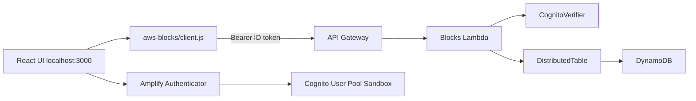

# Amplify の Todo チュートリアルを AWS Blocks で書き直す — バックエンドの中身が見えるハンズオン

> **再現用リポジトリ:** https://github.com/k-adachi-01/hands-on-amplify-todo-to-aws-blocks  
> 章ごとのログ・diff・snapshots: [`docs/chapters/`](chapters/)

## この記事について

| 項目 | 内容 |
| --- | --- |
| **読者** | Amplify Gen 2 の Todo クイックスタートを触ったことがあるフロントエンド寄りの開発者 |
| **作るもの** | ログイン付き Todo アプリ（公式テンプレートを in-place で AWS Blocks 化） |
| **所要時間** | 本編（第1〜2章）90〜120 分 / 発展編（第3章）含め 150〜180 分 |
| **AWS アカウント** | Phase 0 から必要（Amplify Sandbox で Cognito 等を provision） |
| **環境** | [Nix](https://nixos.org/download/) dev shell 内の Node.js v22 + npm（推奨） |

### 始める前のチェックリスト

次をすべて満たしてから Phase 0 に進んでください。

- [ ] **Node.js 22+** と **npm 10+**（Nix を使う場合は `nix develop` 後に `node -v` で確認）
- [ ] **AWS CLI 2.32.0 以降**（`aws --version` で確認）
- [ ] **AWS アカウント**（ルートまたは IAM ユーザーでコンソールにログインできること）
- [ ] **2 つのターミナル**を開けること（Sandbox 用と dev server 用）
- [ ] ブラウザで **http://localhost:3000** にアクセスできること

Nix を使う理由: Node バージョンと npm キャッシュをリポジトリ内に閉じ、読者間の差を減らすため。Nix が無い場合は Node.js 22+ と npm 10+ を手動で用意してください（[AWS Blocks の前提](https://docs.aws.amazon.com/blocks/latest/devguide/getting-started.html) と同様）。

---

## AWS Blocks とは

**AWS Blocks**（2026年6月17日プレビュー公開）は、AWS 上でフルスタックアプリのバックエンドを組み立てるためのツールキットです。まだ触った人は少ない前提で、この節だけ読めば用語が揃います。

[公式ドキュメント](https://docs.aws.amazon.com/blocks/latest/devguide/) の説明を要約すると:

- **Block** — 認証・データ保存・リアルタイムなど、1 機能分のパッケージ（npm）。アプリコード・ローカル開発環境・AWS リソース定義がセットになっている
- **ローカルで動く** — AWS アカウントなしでも `npm run dev` でバックエンドの mock が動く（本ハンズオン Phase 0 以降は Cognito 連携のため Sandbox も使う）
- **同じコードでデプロイ** — ローカルと本番で `aws-blocks/index.ts` を書き換えずに済む設計

本ハンズオンで使う Block の例:

| Block | 役割 |
| --- | --- |
| `DistributedTable` | Todo の永続化（ローカル mock / 本番 DynamoDB） |
| `ApiNamespace` | `createTodo` などの API 関数を定義 |
| `Realtime` | Todo 変更の push 通知（第3章） |
| `CognitoVerifier` | フロントが送る JWT を API 内で検証（第2章） |

AWS Blocks は **プレビュー**です。API やパッケージ名は変わる可能性があります。最新は [AWS Blocks Developer Guide](https://docs.aws.amazon.com/blocks/latest/devguide/) を参照してください。

---

## なぜ Amplify と比べるのか

多くの読者が最初に触るのは [Amplify Gen 2 の Todo クイックスタート](https://github.com/aws-samples/amplify-vite-react-template) です。だから **同じ Todo アプリ** を題材にします。

| 観点 | Amplify Gen 2 | AWS Blocks |
| --- | --- | --- |
| 入口 | 触った人が多い | 2026年6月プレビューで、まだ少数 |
| バックエンドの書き方 | `defineData` でモデル宣言 → CRUD 自動生成 | `aws-blocks/index.ts` に API 関数を書く |
| 処理の見え方 | 認証→保存の順序がフレームワーク内に隠れやすい | `requireAuth` → `put` などコードで追える |
| quickstart の認可 | `publicApiKey()` — 誰でも読み書き可 | 第2章で `userId` 分離を明示的に実装 |
| 既存アプリとの関係 | — | Amplify プロジェクトに **in-place で載せられる**（本ハンズオンの Phase 1） |

「Amplify を捨てる」記事ではありません。**Amplify で動かした UI と Sandbox を活かしつつ、データ層を Blocks の API に差し替える**流れです。

> Amplify 版は「少ないコードで使える」。Blocks 版は「バックエンドの中身が見える」。

---

## リポジトリの準備

```bash
git clone git@github.com:k-adachi-01/hands-on-amplify-todo-to-aws-blocks.git
cd hands-on-amplify-todo-to-aws-blocks
nix develop          # 初回は flake のビルドに少し時間がかかります
npm install          # 依存関係の取得（数分かかることがあります）
```

**確認:**

```bash
node -v    # v22.x 推奨
npm -v     # 10.x 以上
```

`npm install` がエラーなく終われば次へ進めます。

---

## AWS へのログイン（`aws login`）

Amplify Sandbox は AWS にリソースを作るため、**先に CLI から AWS にログイン**します。

長期のアクセスキーを `.aws/credentials` に書く代わりに、AWS CLI 2.32.0 以降の **`aws login`** を使います。マネジメントコンソールと同じ方法でサインインし、**一時的な認証情報**が CLI に渡されます（[公式ブログ](https://aws.amazon.com/jp/blogs/news/simplified-developer-access-to-aws-with-aws-login/)）。

### 手順

1. AWS CLI のバージョンを確認する。

```bash
aws --version
# aws-cli/2.32.0 以上であること
```

2. ログインする（ブラウザが開きます）。

```bash
aws login
```

3. ブラウザの指示に従い、普段コンソールに入るのと同じ方法でサインインする。
4. ターミナルに戻り、自分の AWS 身份が取れるか確認する。

```bash
aws sts get-caller-identity
```

`Account` と `Arn` が JSON で返れば成功です。**このコマンドが通らない状態で Sandbox は動きません。**

### 複数アカウントを使う場合（任意）

名前付きプロファイルでログインする場合:

```bash
aws login --profile my-sandbox
aws sts get-caller-identity --profile my-sandbox
```

そのときだけ、リポジトリ直下に `.env.local` を作り、プロファイル名を書きます（git には含めません）。

```bash
cp .env.local.example .env.local
# .env.local の AWS_PROFILE=my-sandbox のコメントを外す
exit && nix develop   # shellHook が .env.local を読み込む
```

**デフォルトプロファイルで `aws login` しただけなら `.env.local` は不要**です。`npm run sandbox` は設定済みの認証情報をそのまま使います。

### セッションが切れたとき

`ampx sandbox` で `Unable to locate credentials` や `InvalidCredentialError` が出たら、もう一度:

```bash
aws login
aws sts get-caller-identity   # 通ることを確認してから sandbox 再実行
```

---

## 完成イメージと概念マップ

### Before（Amplify Data）

Phase 0 のコード（tag `phase-0-amplify-baseline`）では次の形です。

```typescript
// amplify/data/resource.ts — Todo は content のみ、publicApiKey()
client.models.Todo.create({ content: '...' });
client.models.Todo.observeQuery().subscribe(...);
```

- **モデルを宣言すると CRUD が自動で生える** — 便利だが、裏で何が起きているか追いにくい
- **`publicApiKey()`** — API Key を知っていれば誰でも Todo を読み書きできる（学習用 quickstart 向け。**本番では使わない**）

### After（Blocks + Cognito）

第2章完了時点:


- `Authenticator` でログイン（**UI は Amplify UI コンポーネント**）
- `api.createTodo()` の **中で** `auth.requireAuth(context)` が JWT を検証
- `userId: user.sub` を partition key にし、ユーザーごとにデータ分離

### アーキテクチャ（ハイブリッド dev）

本ハンズオンの `npm run dev` は次の構成です。**初心者が一番混乱しやすい点**なので、表を読んでから Phase 0 に進んでください。



| コンポーネント | 実行場所 | 読者が触るもの |
| --- | --- | --- |
| Cognito / Authenticator | Sandbox が作った User Pool | ブラウザのサインイン画面 |
| Blocks RPC（ブラウザ） | **Sandbox 上の Lambda** | Todo の追加・一覧（裏で API を呼ぶ） |
| Vite UI | ローカル dev server | http://localhost:3000 |

「ローカルで dev しているのに Todo が消えない」のは、**データが AWS 上の DynamoDB に保存されている**ためです。ローカル mock だけではありません。

### ファイル対応表

| 役割 | Amplify | Blocks |
| --- | --- | --- |
| データ定義 | `amplify/data/resource.ts` | `aws-blocks/index.ts` の `DistributedTable` + Zod |
| 認証（API 側） | モデルの `authorization` ルール | `CognitoVerifier` + `requireAuth` |
| 認証（UI 側） | `Authenticator` 等 | 同じく `Authenticator`（第2章） |
| フロント呼び出し | `client.models.Todo.*` | `api.*` |
| 設定 | `amplify_outputs.json` | 同上 + 自動生成の `aws-blocks/client.js` |

---

## Phase 0: Amplify ベースライン

**ゴール:** Amplify Sandbox に Cognito・AppSync・Blocks 用 Lambda を載せ、`amplify_outputs.json` を手元に得る。

### 0-1. 認証の再確認

```bash
aws sts get-caller-identity
```

失敗したら [AWS へのログイン](#aws-へのログインaws-login) に戻る。

### 0-2. ターミナル A — Sandbox を起動

**このターミナルは閉じないでください。** Sandbox はファイル変更を監視し続けます。

```bash
cd hands-on-amplify-todo-to-aws-blocks
nix develop
npm run sandbox
```

初回は **約 4〜5 分**かかります。次のような表示が出れば成功です。

- `✔ Deployment completed`
- `AppSync API endpoint = https://....appsync-api....amazonaws.com/graphql`
- `File written: amplify_outputs.json`
- `[Sandbox] Watching for file changes...`

**うまくいかないとき:**

| 症状 | 対処 |
| --- | --- |
| `InvalidCredentialError` / `Unable to locate credentials` | `aws login` → `aws sts get-caller-identity` |
| すぐ終了する | 上記の成功メッセージが出るまで待つ（初回は長い） |
| リージョン関連のエラー | `aws configure get region` で意図したリージョンか確認 |

`amplify_outputs.json` は **git に commit しない**（API Key 等が含まれるため）。

### 0-3. ターミナル B — UI を起動

**新しいターミナル**を開きます。

```bash
cd hands-on-amplify-todo-to-aws-blocks
nix develop
npm run dev
```

**確認:**

- ターミナルに `http://localhost:3000/` と表示される
- ブラウザで開くと **Sign In / Create Account** の画面が出る

ここまでで Phase 0 完了です。詳細ログ: [chapters/00-clone-and-amplify-baseline/README.md](chapters/00-clone-and-amplify-baseline/README.md)

---

## Phase 1: Blocks 統合

**ゴール:** 同じリポジトリに AWS Blocks の scaffold を載せる（本リポジトリでは **済み**）。自分でゼロからやる場合:

```bash
npx @aws-blocks/create-blocks-app@latest . --yes
```

Amplify を検出すると `aws-blocks/` と `CognitoVerifier` の雛形が入ります。tag: `phase-1-blocks-scaffold`

---

## 第1章: 最小 CRUD

**ゴール:** `client.models.Todo.*` をやめ、`api.createTodo` / `api.listTodos` に置き換える。**まだログインは不要**です。

`aws-blocks/index.ts` に `DistributedTable` と `ApiNamespace` を定義し、フロントは:

```typescript
import { api } from 'aws-blocks';
await api.createTodo(title);
setTodos(await api.listTodos());
```

| Amplify | Blocks |
| --- | --- |
| `observeQuery().subscribe()` | 作成後に `load()` を **手動**で呼ぶ |

```bash
npm run dev
```

ブラウザで Todo を追加し、一覧に出れば OK。tag: `chapter-1-minimal-crud`

---

## 第2章: Cognito + ユーザー分離

**ゴール:** ログインユーザーごとに Todo が見えるようにする。

### 押さえる用語

1. **`Authenticator`（UI）** — サインイン画面。Amplify UI コンポーネント。
2. **`CognitoVerifier`（API）** — リクエストの `Authorization: Bearer <ID token>` を検証。**ログイン画面ではない**。
3. **`auth.requireAuth(context)`** — 各 API の先頭で呼ぶ。未ログインは 401。
4. **`userId: user.sub`** — Cognito が発行するユーザー一意 ID。partition key に使い、他人の行を読めなくする。

```typescript
async createTodo(title: string) {
  const user = await auth.requireAuth(context);
  await todos.put({ userId: user.sub, todoId, title, ... });
}
```

### 手順（UI で確認する場合）

1. ターミナル A・B が起動済みであること（Phase 0 と同じ）
2. ブラウザで http://localhost:3000 を開く
3. **Create Account** で `user-a@example.com` を登録（パスワード例: `TestPass1!` — 大文字・小文字・数字・記号が必要）
4. Todo を 1 件追加（例: `A のタスク`）
5. **Sign out** → `user-b@example.com` で別ユーザー登録 → `B のタスク` を追加
6. それぞれ **自分の Todo だけ** が一覧に出ることを確認

### 手順（コマンドで確認する場合）

```bash
bash scripts/ensure-chapter2-users.sh   # テストユーザーを CLI で作成（UI 登録の代替）
npm run verify:chapter2               # 分離が API レベルで OK か自動チェック
```


tag: `chapter-2-cognito-auth` — 詳細: [chapters/03-chapter2-cognito-auth/README.md](chapters/03-chapter2-cognito-auth/README.md)

---

## 発展編: 第3章 Realtime / ソート / 更新削除

本編のあとに読むセクションです。

- `toggleTodo` — 楽観的ロック（`version`）
- `deleteTodo`
- `listTodos('priority' | 'title')` — Secondary Index
- `subscribeTodos()` — Realtime（ローカルは mock WS、Sandbox では環境により未配線のことがある）

```bash
npm run verify:chapter3
```

tag: `chapter-3-advanced`

---

## 対応表（まとめ）

| やりたいこと | Amplify | Blocks |
| --- | --- | --- |
| 作成 | `client.models.Todo.create()` | `api.createTodo(title)` |
| 一覧 | `observeQuery()` | `api.listTodos()` |
| 認可 | `allow.publicApiKey()` | `requireAuth` + `userId` キー |
| 完了トグル | `update` | `api.toggleTodo` |
| リアルタイム | `observeQuery` | `subscribeTodos` + Realtime |

## Git タグ

`git checkout phase-0-amplify-baseline` などで途中状態に戻れます。

`phase-0-amplify-baseline` → `phase-1-blocks-scaffold` → `chapter-1-minimal-crud` → `chapter-2-cognito-auth` → `chapter-3-advanced`

---

## トラブルシュート

### `ampx sandbox` で認証エラー

1. `aws login`
2. `aws sts get-caller-identity` が通るか確認
3. 名前付きプロファイルを使っているなら `.env.local` の `AWS_PROFILE` と一致しているか確認
4. `npm run sandbox` を再実行

### `npm run dev` ですぐプロセスが終わる

`aws-blocks/scripts/server.ts` で `await startDevServer(...)` が必要です（本リポジトリでは設定済み）。

### ポート 3000 が使えない

別プロセスが占有している可能性があります。`lsof -i :3000` で確認し、古い `npm run dev` を終了してください。

### CLI で Cognito にパスワードログインできない

Amplify が作る App Client は `USER_PASSWORD_AUTH` が無効なことがあります。`npm run verify:chapter2` は Amplify の SRP `signIn` を使います（手順用スクリプト参照）。

### `aws-blocks/client.js` を編集してはいけない

`npm run dev` または `npm run blocks:generate-client` で上書きされます。Sandbox 後は `npm run blocks:generate-client` を実行してください。

### Realtime が動かない

`subscribeTodos` が失敗しても UI は `load()` で動きます。第3章は発展編として割り切って構いません。

---

## 公開・秘密情報

- リポジトリ: https://github.com/k-adachi-01/hands-on-amplify-todo-to-aws-blocks
- `amplify_outputs.json` は commit しない
- Sandbox 片付け: `npm run sandbox:delete`（任意）— [SANDBOX-OPERATIONS.md](SANDBOX-OPERATIONS.md)

---

## まとめ — 読者が持ち帰る設計観点

1. **AWS Blocks** — Block 単位でバックエンド機能を組み立て、同じ TypeScript がローカルと AWS で動く（プレビュー）。
2. **認可の置き場所** — Amplify はモデルルール、Blocks は API 内の `requireAuth` とキー設計。
3. **データの境界** — `publicApiKey()` は学習用。本番では `user.sub` で行を分離する。
4. **抽象化の単位** — 「モデル」から「ドメイン API」へ。コード量は増えても処理の流れが追いやすい。
5. **ハイブリッド dev** — UI はローカル、Cognito と Blocks RPC は Sandbox。どこで何が動いているかを意識する。

次のステップ: [AWS Blocks Developer Guide](https://docs.aws.amazon.com/blocks/latest/devguide/getting-started.html) と、本リポジトリの git tag を辿りながら差分を読むと理解が深まります。
