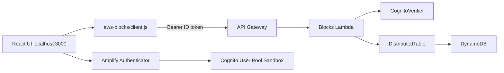

# Amplify の Todo チュートリアルを AWS Blocks で書き直す — バックエンドの中身が見えるハンズオン

> **再現用リポジトリ:** https://github.com/k-adachi-01/hands-on-amplify-todo-to-aws-blocks  
> 章ごとのログ・diff・snapshots: [`docs/chapters/`](chapters/)

## この記事について

| 項目 | 内容 |
| --- | --- |
| **読者** | Amplify Gen 2 の Todo クイックスタートを触ったことがあるフロントエンド寄りの開発者 |
| **作るもの** | ログイン付き Todo アプリ（Amplify 公式テンプレートを in-place で AWS Blocks 化） |
| **所要時間** | 本編（第1〜2章）90〜120 分 / 発展編（第3章）含め 150〜180 分 |
| **AWS アカウント** | Phase 0 から必要（`ampx sandbox` で Cognito + AppSync + Blocks Lambda を provision） |
| **環境** | [Nix](https://nixos.org/download/) dev shell 内の Node.js v22 + npm（ホストを汚さない） |

Nix を使う理由: Node バージョンと npm キャッシュをリポジトリ内に閉じ、読者間の「動いた／動かない」差を減らすため。Nix が無い場合は Node.js 20+ と npm 10+ を手動で用意してください。

---

## はじめに

[amplify-vite-react-template](https://github.com/aws-samples/amplify-vite-react-template) は、少ないコードで Todo アプリを動かせます。一方で次の点が見えにくいです。

- バックエンドの処理順（認証 → 保存 → 返却）がフレームワーク内部に隠れる
- quickstart の Todo は `publicApiKey()` で **誰でも読み書きできる**
- `amplify/auth` と `amplify/data` がコード上つながっていない

本ハンズオンでは **同じ Todo** を起点に **AWS Blocks** へ in-place で書き換えます。

| | Amplify | Blocks |
| --- | --- | --- |
| 抽象化 | モデル宣言 → CRUD 自動生成 | API 関数を自分で書く |
| バックエンド | `amplify/data/resource.ts` | `aws-blocks/index.ts` |
| フロント呼び出し | `client.models.Todo.create()` | `api.createTodo()` |

> Amplify 版は「少ないコードで使える」。Blocks 版は「バックエンドの中身が見える」。

```bash
git clone git@github.com:k-adachi-01/hands-on-amplify-todo-to-aws-blocks.git
cd hands-on-amplify-todo-to-aws-blocks
nix develop && npm install
```

---

## 完成イメージと概念マップ

### Before（Amplify Data）

Phase 0 のコード（tag `phase-0-amplify-baseline`）では次の形です。

```typescript
// amplify/data/resource.ts — Todo は content のみ、publicApiKey()
client.models.Todo.create({ content: '...' });
client.models.Todo.observeQuery().subscribe(...);
```

- モデルを宣言すると CRUD が自動で生える
- `publicApiKey()` は API Key を知っていれば誰でもアクセス可能（学習用 quickstart 向け）

### After（Blocks + Cognito）

第2章完了時点:


- `Authenticator` でログイン
- `api.createTodo()` は API 内で `auth.requireAuth(context)` を通過したユーザーのみ実行
- `userId: user.sub` を partition key にし、ユーザーごとにデータ分離

### アーキテクチャ（ハイブリッド dev）

本ハンズオンの `npm run dev` は **UI だけローカル**、**RPC は Sandbox Lambda** という構成です。



| コンポーネント | 実行場所 |
| --- | --- |
| Cognito / Authenticator | Sandbox が provision した User Pool |
| Blocks RPC（ブラウザ） | Sandbox Lambda（`custom.blocks_api_url`） |
| Vite UI | ローカル dev server |

ブラウザからの Todo 操作は **AWS 上の Lambda** に届きます。ローカル mock ではありません。

### ファイル対応表

| 役割 | Amplify | Blocks |
| --- | --- | --- |
| データ定義 | `amplify/data/resource.ts` | `aws-blocks/index.ts` の `DistributedTable` + Zod |
| 認証 | `amplify/auth/resource.ts`（UI 用） | `CognitoVerifier`（JWT 検証、ログイン画面ではない） |
| フロント呼び出し | `client.models.Todo.*` | `api.*` |
| 設定読み込み | `amplify_outputs.json` | `aws-blocks/client.js`（自動生成） |

---

## Phase 0: Amplify ベースライン

**ゴール:** Sandbox に Cognito + AppSync + Blocks Lambda を載せ、`amplify_outputs.json` を得る。

```bash
aws sso login --profile aws-poc-sandbox
cp .env.local.example .env.local
nix develop   # Loaded .env.local (AWS_PROFILE=...)
```

**ターミナル A:**

```bash
npm run sandbox   # scripts/run-sandbox.sh → ampx sandbox --profile $AWS_PROFILE
```

初回デプロイは約 4〜5 分。成功すると `amplify_outputs.json` が生成されます（**gitignore — commit しない**）。

**ターミナル B:**

```bash
npm run dev   # http://localhost:3000
```

詳細ログ: [chapters/00-clone-and-amplify-baseline/README.md](chapters/00-clone-and-amplify-baseline/README.md)

---

## Phase 1: Blocks 統合

**ゴール:** 同一リポジトリに Blocks scaffold を載せる。

```bash
npx @aws-blocks/create-blocks-app@latest . --yes
```

Amplify 検出時は `CognitoVerifier` 付きの `aws-blocks/` が生成されます。tag: `phase-1-blocks-scaffold`

---

## 第1章: 最小 CRUD

**ゴール:** `client.models.Todo.*` を `api.createTodo` / `api.listTodos` に置き換える。認証はまだ入れない。

`aws-blocks/index.ts` に `DistributedTable` と `ApiNamespace` を定義し、フロントは:

```typescript
import { api } from 'aws-blocks';
await api.createTodo(title);
setTodos(await api.listTodos());
```

| Amplify | Blocks |
| --- | --- |
| `observeQuery().subscribe()` | 作成後に `load()` を手動呼び出し |

```bash
npm run dev
# 第1章のみ API スモーク（別ターミナルで blocks:api を :3002 で起動した場合）
npm run verify:chapter1
```

tag: `chapter-1-minimal-crud` — 詳細: [chapters/02-chapter1-minimal-crud/README.md](chapters/02-chapter1-minimal-crud/README.md)

---

## 第2章: Cognito + ユーザー分離

**ゴール:** ログインユーザーごとに Todo を分離する。

### バックエンドの要点

1. **`CognitoVerifier`** — リクエストの `Authorization: Bearer <ID token>` を検証する。**ログイン UI ではない**（UI は `Authenticator`）。
2. **`auth.requireAuth(context)`** — 各 API メソッドの先頭で呼び、未認証は 401。
3. **`userId: user.sub`** — Cognito の一意 ID を partition key にし、他ユーザーの行にアクセスできないようにする。

```typescript
async createTodo(title: string) {
  const user = await auth.requireAuth(context);
  await todos.put({ userId: user.sub, todoId, title, ... });
}
```

### 手順

```bash
# Phase 0 と同様に sandbox + dev を起動済みであること
bash scripts/ensure-chapter2-users.sh
npm run verify:chapter2
npm run capture:screenshots
```

検証結果（2026-06-23）:

| ユーザー | 一覧 |
| --- | --- |
| user-a@example.com | `A のタスク` のみ |
| user-b@example.com | `B のタスク` のみ |


tag: `chapter-2-cognito-auth` — 詳細: [chapters/03-chapter2-cognito-auth/README.md](chapters/03-chapter2-cognito-auth/README.md)

---

## 発展編: 第3章 Realtime / ソート / 更新削除

本編を終えたあとに読むセクションです。

- `toggleTodo` — `version` + `ifFieldEquals` による楽観的ロック
- `deleteTodo`
- `listTodos('priority' | 'title')` — Secondary Index
- `subscribeTodos()` — Realtime（ローカル dev は mock WS、Sandbox では別途配線が必要な場合あり）

```bash
npm run verify:chapter3
```

tag: `chapter-3-advanced` — 詳細: [chapters/04-chapter3-advanced/README.md](chapters/04-chapter3-advanced/README.md)

---

## 対応表（まとめ）

| やりたいこと | Amplify | Blocks |
| --- | --- | --- |
| 作成 | `client.models.Todo.create()` | `api.createTodo(title)` |
| 一覧 | `observeQuery()` | `api.listTodos()` |
| 認可 | `allow.publicApiKey()` | `requireAuth` + `userId` キー |
| 完了トグル | `update` | `api.toggleTodo` |
| リアルタイム | `observeQuery` | `subscribeTodos` + Realtime |

## Git タグ

各マイルストーンで `git checkout <tag>` するとその時点のコードに戻れます。

`phase-0-amplify-baseline` → `phase-1-blocks-scaffold` → `chapter-1-minimal-crud` → `chapter-2-cognito-auth` → `chapter-3-advanced`

---

## トラブルシュート

### `ampx sandbox` で InvalidCredentialError

`.env.local` に `AWS_PROFILE` を設定し、`nix develop` で読み込む。`npm run sandbox` は内部で `--profile` を付与します。

### `aws sso login` 後も認証エラー

シェルに `AWS_PROFILE` が無いと失敗します。

```bash
AWS_PROFILE=aws-poc-sandbox aws sts get-caller-identity
```

### CLI で Cognito パスワード認証が使えない

Amplify 管理の App Client は `USER_PASSWORD_AUTH` 非許可です。`npm run verify:chapter2` は Amplify SRP `signIn` を使います。

### `aws-blocks/client.js` を編集してはいけない

`npm run dev` または `npm run blocks:generate-client` で上書きされます。Sandbox 後は `blocks:generate-client` を実行してください。

### Realtime が動かない

Sandbox 未デプロイや WS 未配線時は `subscribeTodos` が失敗することがあります。UI は `load()` でフォールバックします。

### dev server が即終了する

`aws-blocks/scripts/server.ts` で `await startDevServer(...)` が必要です。

---

## 公開・秘密情報

- リポジトリ: https://github.com/k-adachi-01/hands-on-amplify-todo-to-aws-blocks
- `amplify_outputs.json` は commit しない（マスク例: `docs/**/snapshots/amplify_outputs.masked.example.json`）
- Sandbox 片付け: `npm run sandbox:delete`（任意）— 手順は [docs/SANDBOX-OPERATIONS.md](SANDBOX-OPERATIONS.md)

---

## まとめ — 読者が持ち帰る設計観点

1. **認可はどこで効くか** — Amplify はモデルの `authorization` ルール、Blocks は API 関数内の `requireAuth` とキー設計。
2. **データの境界** — `publicApiKey()` は学習用。本番では `user.sub` などで行を分離する。
3. **抽象化の単位** — 「モデル」から「ドメイン API」へ。コード量は増えても、処理の流れが追いやすくなる。
4. **dev と本番の対応** — 同じ `aws-blocks/index.ts` がローカル mock と Lambda で動く。ハイブリッド dev では Cognito と RPC の実行場所を意識する。

次のステップ: [AWS Blocks 公式ドキュメント](https://github.com/aws/aws-blocks) と、本リポジトリの tag を辿りながら差分を読むと理解が深まります。
